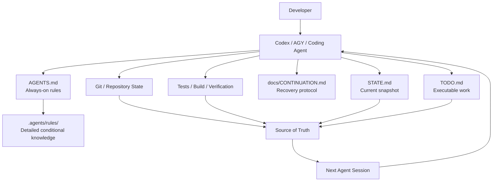

# AI Agent Workspace Architecture

A lightweight, vendor-neutral repository-state architecture for long-running AI coding workflows.

這是一套給 Codex、AGY 與其他 Coding Agent 使用的持久化專案架構。核心目標不是讓 Agent「記住更多對話」，而是讓 Repository 自己保存足以恢復工作的狀態。

> **核心觀念：不要讓 Agent 靠聊天記憶工作，讓 Repository 本身成為可以持續交接的工作現場。**

## Core idea

```text
Conversation State  →  Repository State
```

專案以四個核心文件管理 Agent 工作：

```text
AGENTS.md
STATE.md
TODO.md
docs/CONTINUATION.md
```

大型規則則採 progressive disclosure：

```text
.agents/rules/
```

## Architecture



這套架構的目的不是保存整段聊天，而是讓任何新的 Agent session 都能從 Repository 重新建立足夠的工作上下文。

## Two-layer architecture

如果你只有一個專案，直接使用 Project Layer 即可；如果最上層資料夾包含很多獨立專案，則使用 Workspace + Project 兩層治理。

```text
Workspace/
├── AGENTS.md
├── STATE.md
├── TODO.md
├── CONTINUATION.md
└── PROJECT_AGENT_STANDARD.md

Project/
├── AGENTS.md
├── STATE.md
├── TODO.md
├── docs/
│   └── CONTINUATION.md
└── .agents/
    └── rules/
```

### AGENTS.md

Always-on invariants：技術棧、安全邊界、不可破壞契約、驗證方式、部署限制，以及 startup / resume protocol。

### STATE.md

目前專案狀態快照。不是日誌，不記錄每一次小修改。

### TODO.md

只保存仍具有行動價值的工作：`Current / Next / Later / Blocked`。

### docs/CONTINUATION.md

定義 quota reset、terminal 關閉、context reset、換 Agent 後如何重新建立工作狀態。

### .agents/rules/

只在需要時才載入的詳細知識，例如 data contracts、API contracts、deployment procedures。

---

# 5 分鐘快速開始

## 方法 A：建立新專案

Clone 本 Repository：

```bash
git clone https://github.com/mihozip/ai-agent-workspace-architecture.git
cd ai-agent-workspace-architecture
```

使用 bootstrap script：

```bash
./scripts/bootstrap-project.sh my-project
cd my-project
```

如果 script 沒有執行權限：

```bash
chmod +x ../ai-agent-workspace-architecture/scripts/bootstrap-project.sh
```

也可以直接複製 Project template：

```bash
cp -R templates/project my-project
cd my-project
```

接著初始化 Git（選用，但建議）：

```bash
git init
git add .
git commit -m "Initialize AI Agent project architecture"
```

啟動你的 Coding Agent，例如：

```bash
codex
```

進入 Agent 後輸入：

```text
啟動專案
```

Agent 應先執行 Read-only Startup，回報目前專案狀態，而不是直接修改程式碼。

如果工作狀態已經明確，希望它直接接著做：

```text
啟動專案並繼續
```

## 方法 B：直接複製四件套

如果不需要完整範本，只需要最核心架構：

```text
AGENTS.md
STATE.md
TODO.md
docs/CONTINUATION.md
```

詳細資料字典、API 契約、部署 SOP 等，再視需要加入：

```text
.agents/rules/
```

---

# 既有專案如何 Migration

不要直接用 template 覆蓋舊專案的 `AGENTS.md`。

Migration 的核心原則是：

```text
先理解現有規則
      ↓
保留 Critical Invariants
      ↓
把短期狀態移到 STATE.md
      ↓
把可執行工作移到 TODO.md
      ↓
把詳細資料字典 / API 契約移到 .agents/rules/
      ↓
建立 CONTINUATION.md
      ↓
驗證沒有遺失專案特有規則
```

建議流程：

1. 先 commit 或備份現有專案。
2. 閱讀現有 `AGENTS.md`、README、主要設定檔與 Git 狀態。
3. 保留真正需要 always-on 的 Critical Invariants。
4. 將「目前做到哪裡」整理到 `STATE.md`。
5. 將「接下來做什麼」整理到 `TODO.md`。
6. 將大型資料字典、API contract、deployment SOP 拆到 `.agents/rules/`。
7. 建立 `docs/CONTINUATION.md`。
8. 確認新的 Agent session 不需要上一段對話也能恢復工作。

完整 migration 指南請看：[`MIGRATION.md`](MIGRATION.md)。

---

## Startup commands

建議定義兩個人類可讀的 shortcut：

```text
啟動專案
```

Read-only startup。Agent 恢復 context、檢查 Git、找出下一步，輸出 Project Startup Brief 後停止。

```text
啟動專案並繼續
```

使用相同 startup procedure；若 Current Task 明確且沒有 blocker，則繼續目前工作。

## Project Startup Brief

建議 Agent 啟動時統一輸出：

```text
Project Startup Brief

Project:
Repository:
Branch:
Working Tree:
Current Goal:
In Progress:
Highest Priority Task:
Blockers:
Relevant Files:
Recommended Next Action:

Ready.
```

## Source of Truth Priority

當聊天紀錄、文件與實際 Repository 狀態發生衝突時，建議優先順序為：

```text
1. Current repository files
2. Git state / history
3. Tests / build results
4. STATE.md
5. TODO.md
6. Previous conversation
```

Conversation memory is not authoritative.

## Repository contents

- `ARTICLE.md` — 完整中文介紹文章
- `PROJECT_AGENT_STANDARD.md` — 專案架構標準
- `MIGRATION.md` — 既有專案導入指南
- `templates/workspace/` — 多專案 Workspace Governance 範本
- `templates/project/` — Standalone Project 範本
- `templates/project/.agents/rules/` — Progressive-disclosure 規則範例
- `scripts/bootstrap-project.sh` — 快速建立新專案骨架

## Design principles

1. Repository state is more authoritative than conversation memory.
2. `AGENTS.md` stays short and stable.
3. `STATE.md` is a snapshot, not a changelog.
4. `TODO.md` contains executable work, not project history.
5. Detailed rules are loaded only when relevant.
6. A fresh Agent must be able to recover without the previous conversation.
7. Deployment, destructive changes, sensitive data, and other high-impact actions remain behind explicit human review.

## Suitable for

這套架構不綁定特定技術棧，可用於：

- Google Apps Script
- PHP / Laravel
- React / TypeScript
- Python
- CLI tools
- Multi-repository workspaces
- 其他需要長時間 Coding Agent 協作的專案

## Further reading

如果想先理解這套方法為什麼出現，請閱讀 [`ARTICLE.md`](ARTICLE.md)。

## License

MIT
